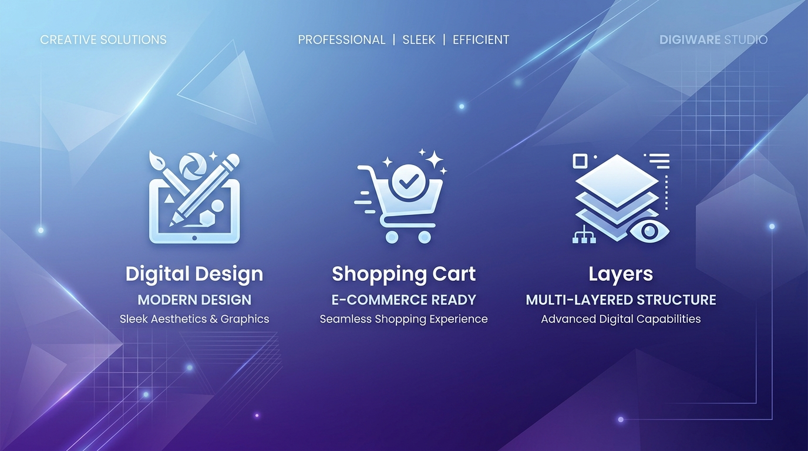

<div align="center">



# 🌟 کیت یار (KitYar)

**دستیار طراحی هوشمند و اتوماسیون کاور محصولات برای مارکت‌پلیس‌های ایرانی**

ژاکت · راست‌چین · کافه‌بازار · مایکت

[](https://github.com/ehsanking/kityar/actions/workflows/ci.yml)
[](https://github.com/ehsanking/kityar/releases)
[](#-نصب-nodejs-در-صورت-تحریم-یا-قطعی)
[](https://github.com/ehsanking/kityar/stargazers)

[نصب سریع](#-نصب-سریع-یک-خطی) · [امکانات](#-امکانات) · [نصب Node.js در صورت تحریم](#-نصب-nodejs-در-صورت-تحریم-یا-قطعی) · [کلید هوش مصنوعی](#-دریافت-کلید-gemini)

</div>

---

## ⚡ نصب سریع (یک خطی)

### ویندوز (PowerShell)

**PowerShell** را باز کنید (در منوی Start عبارت `PowerShell` را جستجو کنید) و این یک خط را اجرا کنید:

```powershell
irm https://raw.githubusercontent.com/ehsanking/kityar/main/install.ps1 | iex
```

این دستور به‌ترتیب:

1. **Node.js** را بررسی می‌کند و اگر نصب نباشد، نسخهٔ LTS را با `winget` نصب می‌کند.
2. کیت یار را در پوشهٔ `kityar` در پوشهٔ کاربری شما دانلود می‌کند (اگر از قبل وجود داشته باشد، به‌روزش می‌کند).
3. پکیج‌ها را نصب می‌کند.
4. برنامه را اجرا و مرورگر را روی **http://localhost:32600** باز می‌کند.

> [!TIP]
> **دانلود پکیج‌ها کند است یا قطع می‌شود؟** همان دستور را با یک میرور npm اجرا کنید:
>
> ```powershell
> $env:KITYAR_NPM_MIRROR = "https://registry.npmmirror.com"; irm https://raw.githubusercontent.com/ehsanking/kityar/main/install.ps1 | iex
> ```
>
> فهرست میرورها در [بخش تحریم](#-نصب-nodejs-در-صورت-تحریم-یا-قطعی) آمده است.

<details>
<summary><b>تنظیمات اختیاری نصب‌کننده</b></summary>

| متغیر | کاربرد | پیش‌فرض |
|---|---|---|
| `KITYAR_DIR` | پوشهٔ نصب | `%USERPROFILE%\kityar` |
| `KITYAR_NPM_MIRROR` | آدرس میرور npm | رجیستری رسمی |
| `KITYAR_NO_START` | با مقدار `1`، فقط نصب می‌کند و برنامه را اجرا نمی‌کند | — |

نمونه: نصب در درایو D بدون اجرای خودکار

```powershell
$env:KITYAR_DIR = "D:\kityar"; $env:KITYAR_NO_START = "1"; irm https://raw.githubusercontent.com/ehsanking/kityar/main/install.ps1 | iex
```

دفعات بعد برای اجرا کافی است بنویسید:

```powershell
cd $HOME\kityar; npm run dev
```

</details>

> [!NOTE]
> اگر خطای *running scripts is disabled* دیدید، یک بار این دستور را بزنید و دوباره نصب کنید:
> `Set-ExecutionPolicy -Scope CurrentUser RemoteSigned`

### نسخهٔ دسکتاپ (بدون نیاز به Node.js)

از صفحهٔ **[Releases](https://github.com/ehsanking/kityar/releases)** فایل مناسب سیستم خود را دانلود کنید:

| سیستم | فایل |
|---|---|
| ویندوز (نصبی) | `KitYar Setup x.x.x.exe` |
| ویندوز (بدون نصب) | `KitYar x.x.x.exe` |
| مک با تراشهٔ Apple (M1 تا M4) | `KitYar-x.x.x-mac-arm64.dmg` |
| مک اینتل | `KitYar-x.x.x-mac-x64.dmg` |

#### ⚠️ ویندوز: پیام «Windows protected your PC» و دکمهٔ Don't run

هنگام اجرای اولین بار، ممکن است پنجرهٔ آبی **Microsoft Defender SmartScreen** با عنوان **Windows protected your PC** باز شود و فقط دکمهٔ **Don't run** دیده شود. **روی Don't run نزنید.** این پیام به معنی ویروسی بودن فایل نیست؛ فقط یعنی برنامه گواهی امضای کد (Code Signing) ندارد و ویندوز ناشر آن را نمی‌شناسد.

برای اجرا:

1. روی عبارت کوچک **More info** (اطلاعات بیشتر) زیر متن پیام کلیک کنید.
2. دکمهٔ **Run anyway** (در هر صورت اجرا شود) ظاهر می‌شود؛ روی آن بزنید.
3. این کار فقط بار اول لازم است.

<details>
<summary>دکمهٔ Run anyway نمایش داده نمی‌شود؟</summary>

- **فایل را از اینترنت دانلود کرده‌اید و ویندوز آن را مسدود کرده:** روی فایل `.exe` راست‌کلیک کنید ← **Properties** ← در پایین تب **General**، تیک **Unblock** را بزنید ← **OK**، سپس دوباره اجرا کنید.
- **ویندوز در حالت S (Windows S mode) است:** در این حالت فقط برنامه‌های Microsoft Store اجرا می‌شوند؛ باید از حالت S خارج شوید یا از [نسخهٔ وب](#-نصب-سریع-یک-خطی) استفاده کنید.
- **سیستم سازمانی/اداری است:** ممکن است مدیر شبکه اجرای برنامه‌های ناشناس را مسدود کرده باشد؛ از نسخهٔ وب استفاده کنید.

</details>

> [!IMPORTANT]
> فقط فایل‌های صفحهٔ **[Releases همین مخزن](https://github.com/ehsanking/kityar/releases)** را اجرا کنید. نسخه‌ای که از جای دیگری دانلود شده ممکن است دستکاری شده باشد.

#### مک

> [!NOTE]
> **مک:** برنامه را از فایل dmg به پوشهٔ Applications بکشید. چون برنامه با گواهی اپل امضا نشده، اگر پیام «آسیب دیده است» یا «باز نمی‌شود» دیدید، یک بار در Terminal بزنید:
> ```bash
> xattr -cr /Applications/KitYar.app
> ```

### نصب دستی (لینوکس، مک یا برای توسعه‌دهندگان)

```bash
git clone https://github.com/ehsanking/kityar.git
cd kityar
npm install
npm run dev        # http://localhost:32600
```

---

## ✨ امکانات

| | |
|---|---|
| 🎨 **استودیوی لایه‌ای** | ویرایش لایه‌ها، خط‌کش، راهنمای مغناطیسی و Undo/Redo کامل (Ctrl+Z / Ctrl+Shift+Z) |
| ✅ **بررسی استاندارد مارکت‌پلیس** | اندازه‌گیری واقعی بوم: متن‌های ریز، خروج از حاشیهٔ امن، لایه‌های بیرون از بوم، همراه با امتیاز |
| 🤖 **هوش مصنوعی** | تولید وکتور و تصویر با Gemini، OpenAI یا Claude (با کلید خودتان) |
| 🏷️ **کیت برند** | رنگ‌ها و فونت برند را یک بار ذخیره و روی همهٔ طرح‌ها اعمال کنید |
| 📦 **تولید دسته‌ای** | از یک فایل CSV، برای ده‌ها محصول کاور بسازید (`{{name}}` در متن لایه‌ها) |
| 📤 **خروجی کامل** | PNG، PDF، PSD لایه‌باز و پکیج ZIP همهٔ سایزها |
| ✏️ **طراحی آزاد و نمودار** | بوم رسم شکل (Konva) و نمودارساز محصول |
| 💾 **ذخیرهٔ خودکار** | ذخیره در مرورگر (IndexedDB)، فایل پروژه و اجرای آفلاین (PWA) |

---

## 🟢 پیش‌نیاز: Node.js

برای اجرای نسخهٔ وب به **Node.js نسخهٔ ۲۰ یا بالاتر** نیاز دارید. نصب‌کنندهٔ یک‌خطی این مرحله را خودش انجام می‌دهد. برای بررسی دستی:

```powershell
node --version   # باید v20 یا بالاتر باشد
```

## 🌐 نصب Node.js در صورت تحریم یا قطعی

اگر `nodejs.org` یا `winget` در دسترس نیست، یا دانلود پکیج‌های npm قطع می‌شود، از این راه‌ها استفاده کنید.

### ۱. دریافت فایل نصبی Node.js از منابع جایگزین

- **میرور npmmirror:** در [npmmirror.com/mirrors/node](https://npmmirror.com/mirrors/node/) وارد پوشهٔ آخرین نسخهٔ LTS شوید و فایل `node-vXX.X.X-x64.msi` را دانلود کنید.
- **سایت‌های دانلود داخلی:** بسیاری از سایت‌های دانلود نرم‌افزار ایرانی نسخهٔ LTS از Node.js را هم منتشر می‌کنند. کافی است عبارت «دانلود Node.js LTS» را جستجو کنید.

> [!WARNING]
> **امنیت:** فایل نصبی را فقط از منبع معتبر بگیرید. قبل از نصب، روی فایل `.msi` راست‌کلیک کنید و در **Properties ← Digital Signatures** مطمئن شوید امضاکننده **OpenJS Foundation** است. فایل بدون امضا یا با امضای دیگر را نصب نکنید.

بعد از نصب، PowerShell را **ببندید و دوباره باز کنید** و دستور نصب یک‌خطی را دوباره اجرا کنید.

### ۲. میرور npm برای نصب پکیج‌ها

اگر مرحلهٔ «Installing dependencies» خطا داد یا بیش از حد طول کشید، یکی از این میرورها را امتحان کنید:

| میرور | آدرس |
|---|---|
| npmmirror | `https://registry.npmmirror.com` |
| رانفلر (ایرانی) | `https://mirror-npm.runflare.com` |
| لیارا (ایرانی) | `https://package-mirror.liara.ir/repository/npm/` |

> [!NOTE]
> آدرس و در دسترس بودن میرورها ممکن است تغییر کند. اگر یکی کار نکرد، بعدی را امتحان کنید.

با نصب‌کنندهٔ یک‌خطی:

```powershell
$env:KITYAR_NPM_MIRROR = "https://mirror-npm.runflare.com"; irm https://raw.githubusercontent.com/ehsanking/kityar/main/install.ps1 | iex
```

یا به‌صورت دائمی برای همهٔ پروژه‌ها:

```powershell
npm config set registry https://mirror-npm.runflare.com
# برای برگشت به رجیستری رسمی:
npm config delete registry
```

### ۳. اگر `raw.githubusercontent.com` باز نمی‌شود

کد را به‌صورت ZIP از دکمهٔ سبز **Code ← Download ZIP** همین صفحه دانلود و از حالت فشرده خارج کنید. سپس در PowerShell داخل آن پوشه بروید و فایل نصب را مستقیم اجرا کنید:

```powershell
cd $HOME\Downloads\kityar-main
powershell -ExecutionPolicy Bypass -File .\install.ps1
```

---

## 🔑 دریافت کلید Gemini

کلید هوش مصنوعی اختیاری است و فقط برای تب «هوش مصنوعی» لازم است.

1. به [Google AI Studio](https://aistudio.google.com) بروید و با حساب گوگل وارد شوید. *(ممکن است برای ثبت‌نام به ابزار عبور از تحریم نیاز داشته باشید.)*
2. روی **Get API Key** و بعد **Create API Key** بزنید و کلید را کپی کنید.
3. در کیت یار، در تب **هوش مصنوعی ← تنظیم کلیدها** کلید را وارد کنید.

کلیدهای OpenAI و Claude هم در همان پنل پشتیبانی می‌شوند. به‌جای وارد کردن کلید در برنامه، می‌توانید آن را در فایل `.env` پوشهٔ پروژه هم قرار دهید:

```env
GEMINI_API_KEY=your_gemini_key_here
```

---

## 🔤 بارگذاری فونت شخصی

هیچ فونت پولی داخل مخزن نیست. فونت خریداری‌شدهٔ خود را این‌طور اضافه کنید:

1. در ادیتور به بخش تنظیمات متن یا مدیریت فونت بروید.
2. روی **«بارگذاری فایل فونت»** کلیک و فایل `.ttf` یا `.woff2` را انتخاب کنید.
3. **پیشنهاد:** برای نمایش درست همهٔ ضخامت‌ها، نسخهٔ **Variable Font** را بارگذاری کنید.

---

## 🛠️ برای توسعه‌دهندگان

| دستور | کاربرد |
|---|---|
| `npm run dev` | اجرای برنامه به‌همراه API روی پورت 32600 |
| `npm test` | تست‌های واحد (Vitest) |
| `npm run test:e2e` | تست‌های مرورگر (Playwright) |
| `npm run lint` | بررسی تایپ‌ها |
| `npm run build` | ساخت نسخهٔ production |
| `npm run electron:pack` | ساخت نسخهٔ دسکتاپ |

---

## ⚖️ کپی‌رایت و سلب مسئولیت

- **فونت‌ها:** کیت یار به‌طور پیش‌فرض از فونت متن‌باز و رایگان **وزیرمتن (Vazirmatn)** استفاده می‌کند. استفاده از فونت‌های تجاری (مانند ایران‌سنس، ایران‌یکان و...) اختیاری است و تهیهٔ لایسنس معتبر آن‌ها کاملاً بر عهدهٔ کاربر است.
- **برند کیت یار:** کدها، ایده، نام و لوگوی **کیت یار (KitYar)** متعلق به توسعه‌دهندگان اولیه است. شخصی‌سازی کد مجاز است، اما **حذف یا تغییر نام و کپی‌رایت توسعه‌دهندهٔ اصلی در هدر، فوتر یا صفحهٔ درباره‌ما مجاز نیست**.
- **سلب مسئولیت:** کیت یار ابزاری کمکی است و هیچ ارتباط حقوقی یا سازمانی با ژاکت، راست‌چین یا سایر مارکت‌پلیس‌ها ندارد. مسئولیت استفاده از تصاویر نهایی و کلیدهای هوش مصنوعی بر عهدهٔ کاربر است.

---

<div align="center">

اگر کیت یار به کارتان آمد، با یک ⭐ از پروژه حمایت کنید.

</div>

<p align="center">Designed with ❤️ by <b>EHSANKiNG</b></p>
